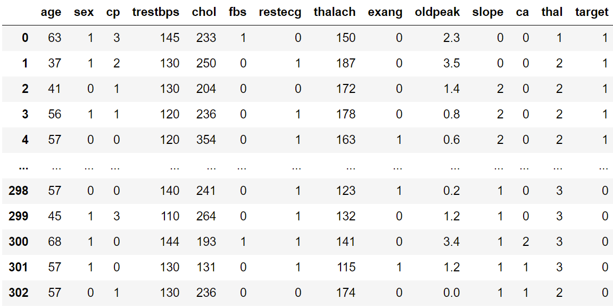

# heart-disease-classifier

## About

- Given appropriate clinical parameters of a patient, the machine learning model predicts whether or not the patient has heart disease with over &asymp; 90% accuracy.
- The dataset was taken from [Kaggle](https://www.kaggle.com/ronitf/heart-disease-uci) and was trained with different machine learning models and hyper parameters.
- The model was evaluated with accuracy score, optimum results were obtained with logistic regression estimator.
- View [Deployment](https://heartdiseaseclassification.herokuapp.com/)

## Data Dictionary

- Age
- Sex
- Chest Pain Type (4 Values)
- Resting Blood Pressure
- Serum Cholestoral (mg/dl)
- Fasting Blood Sugar (mg/dl)
- Resting Electrocardiographic Results (Values 0,1,2)
- Maximum Heart Rate Achieved
- Exercise Induced Angina
- Old-Peak (ST depression Induced by Exercise Relative to Rest)
- The Slope of the Peak Exercise ST Segment
- Number of Major Vessels (0-3) Colored by Flourosopy
- Thal: 3 = Normal, 6 = Fixed Defect, 7 = Reversable Defect

## Sample Data

